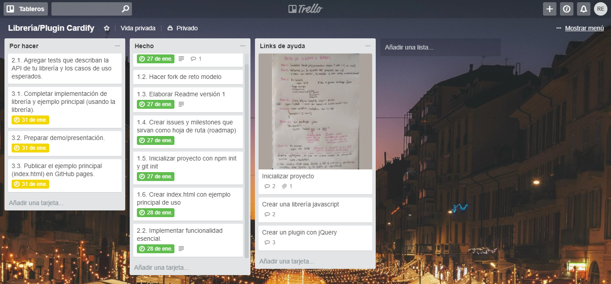
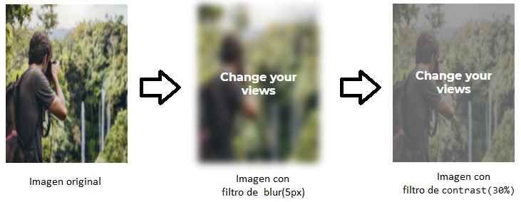

# Cardify

* **Track:** _Common Core_
* **Curso:** _JS Deep Dive: Crea tu propia librería usando JavaScript_
* **Unidad:** _Producto final_

***

## Introducción 

Este proyecto consiste en implementar un plugin de jQuery que dado un _contenedor_ debe buscar todas las imágenes que encuentre dentro del _contenedor_ y reemplazarlas por un nuevo elemento `<figure>` que contenga la imagen `` y además de un `<figcaption>`
con el texto del atributo `alt` de la imagen, el cual se visualiza al momento de hacer un `hover` sobre la imagen.

## Flujo de trabajo

El proyecto se desarrolló en una semana y se propusieron los siguientes checklists de progreso para cada etapa:

#### ETAPA 1

* Escribir primera versión del `README.md` que contenga una descripción general del proyecto y el desarrollo del plugin.
* Crear issues y milestones que sirvan como hoja de ruta (roadmap).
* Inicializar proyecto con `npm init` y `git init`.
* Crear `index.html` con ejemplo principal de uso.

#### ETAPA 2

Implementar funcionalidad esencial (función Cardify):

* Agregar etiqueta `<figure>` a cada elemento `` que se encuentre dentro del contenedor.
* Agregar etiqueta `<figcaption>` a cada elemento `` que se encuentre dentro del contenedor.
* Mostrar información del atributo 'alt' al hacer hover sobre cada imagen.
* Agregar estilos css para cuando se hace hover sobre cada imagen.

#### ETAPA 3

* Completar implementación del plugin con un sistema de grillas.
* Preparar demo/presentación (incluye ejemplo principal).
* Publicar el ejemplo principal (`index.html`) en GitHub pages.

Se utiliza Trello para el seguimiento de las tareas planificadas:



## Archivos importantes

El proyecto presenta los siguientes archivos para uso del usuario:

* `README.md` con descripción de la librería, instrucciones de instalación, uso y documentación del API.
* `index.js`: Plugin que exporta una función u objeto al entorno global (`window`).
* `index.css`: Archivo css que contiene los estilos de hover y grilla.
* `index.html`: Página web del plugin (demo) que contiene un ejemplo de uso.
* `package.json` con nombre, versión, descripción, autores, licencia, dependencias, scripts (pretest, test, ...).

## Especificaciones

* Se utilizó el framework Bootstrap en su versión 4.0.
* Se utilizó la librería jQuery en su versión 3.3.1.
* Se utilizó el estándar más recientemente aceptado de JavaScript ES2015 || ES6.
* Se utilizó el transpilador/compilador Babel para que convierta nuestro código en ES5 de forma automática.

***

## Instalación

### Global (navegador)

```html
<link rel="stylesheet" href="index.css">
```

```html
<script src="https://code.jquery.com/jquery-3.3.1.min.js"></script>
<script src="index.js"></script>
```

## Uso

```js
// `container` es el selector del contenedor donde se buscarán todas las
// imágenes a ser procesadas.
$('.container').cardify();
```

## Ejemplo de uso
Al usar la función cardify, su archivo html quedaría de la siguiente manera:

```html
<figure class="figureStyle">
    
    <figcaption class="figcaptionStyle displayNone">Ramon Casas : Pintura 1900  Museo Nacional de Arte de Cataluña</figcaption>
</figure>
```



***

## Autoras

* Rocci Escobar Nuñez
* Manuela Flores Vilchez